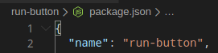
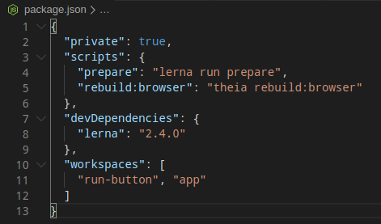
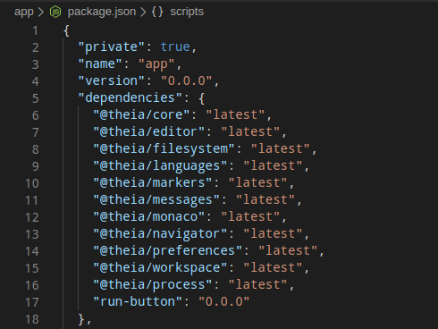

# Theia IDE

## Introduction

This is an online IDE built on top of the [Theia IDE](https://theia-ide.org/docs/composing_applications/) intended to be used for programming courses. The prerequisites can be found [here](https://github.com/eclipse-theia/theia/blob/master/doc/Developing.md). The application can be run on your host OS, but we recommend using Docker.

## Docker

It is required for you to have [Docker](https://docs.docker.com/get-docker) installed on your system. The Dockerfile found in the root of this repository can be used to build a docker image and it is intended to provide the required development environment for this application. To build a docker image from this Dockerfile, run the following command in the repository root:
```bash
docker build -t theia-dev .
```
*theia-dev* is the name of the Docker image you just built. To create a container, run:
```bash
docker container run -d -p 3000:3000 --name theia theia-dev
```
This will create a container and run it in detached mode on port 3000 on the host machine. The name of the container is *theia* in this case (the string following the `--name` flag). When the container is initially created, this repository gets cloned into the `/home/theia/app` directory. To access the container shell, run the following in your command line:
```bash
docker container exec -it theia "bash"
```
*theia* being the name of the container. Once you bash into the container, your current working directory is `/home/theia/app`. The user you run *bash* as is **theia** and the password for this user is **theia** if needed.

## Running the application

The application needs to be built initially and dependencies need to be pulled. To do so, run the following at the root of the repository:
```bash
yarn
```
*yarn* (a nodejs package manager) will pull all the dependencies of the application. After that it runs the build process to compile the typescript source code to javascript.

After the initial build, to rebuild the application later on, use:
```bash
yarn prepare
```
After the build is done, run the following script to start the application:
```bash
./start.sh
```
The script runs the *start* command defined in `app/package.json`. The default *port* used is `3000` and the default *hostname* is `0.0.0.0` (This is important when runnning the application in a container). An optional parameter is the path to the workspace folder you wish the application to open (Can be done in the application when it starts).

For example:
```bash
./start.sh /path/to/workspace --port=8080 --hostname=0.0.0.0
```

## Creating a new extension

For ease of use, to create a new extension, run the following script at the root of the repository:
```bash
./generate-extension.sh
```
You will be prompted to give the name of the extension, to choose a template, to give the author name, licence and description. After that the extension should have been created. To include the extension in the application add the extension to **workspaces** in `./package.json` and to **dependencies** in `./app/package.json`.

<!-- TODO: Improve this bit... -->

<!-- Your extension should have a name that you provided and the /your-extension/package.json file should have it stored. Like this:



Use the name of your extension and the version where it needs to be provided. The /package.json file should look like this:



The /app/package.json file should look like this: 



Version 0.0.0 can be found in the /your-extension/package.json file -->
